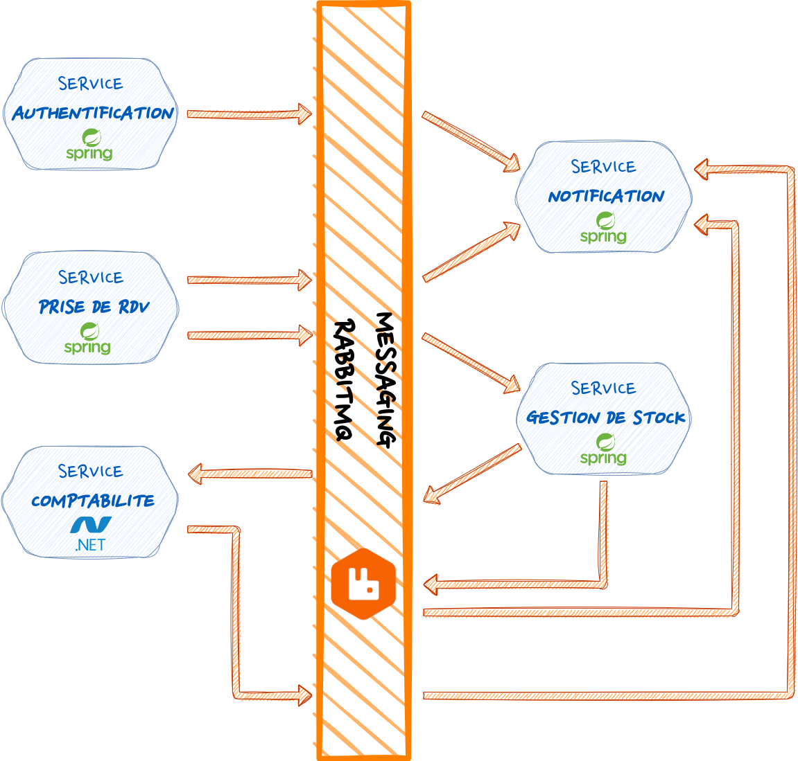

# Microservices-Project
Conception et implementation d'une application qui fait la **gestion des ressources matérielles** des différents départements d’une faculté en respectant **l'architecture des microservices** avec le framework **Spring Boot**.

# Problématique
 Une petite clinique offrant des services de spécialistes médicaux. Les patients peuvent prendre rendez-vous en ligne via notre plateforme Doctolib. Les médecins examinent les patients et fournissent tous les détails de la consultation, ainsi que les médicaments prescrits.

Le service de gestion des stocks gère les médicaments et passe des commandes auprès des fournisseurs. Le service de facturation génère des factures pour les fournisseurs et les clients. Nous avons également un système d'authentification pour les patients et le personnel, ainsi qu'un service de notification pour informer les patients par e-mail de leur rendez-vous et notifier le personnel de toute nouvelle affectation.

Nous sommes déterminés à fournir des soins de qualité à nos patients et à garantir la satisfaction de nos clients en fournissant des services de gestion de stock et de facturation efficaces et fiables.

# Acteurs
Voici les différents acteurs de l’application :
+ Personnels médicals
+ Patients
+ Secrétaire
+ Fournisseur
+ Administrateur

# Microservices
Il y a dix microservices :

+ Microservice d'Authentification
+ Microservice de la gestion des stocks et des fournisseurs
+ Microservice de la gestion des rdv/patients et du personnel
+ Microservice de la creation des factures
+ Microservice des notifications

Le travail est divisé par cinq, chacun prend deux microservices et moi j'ai pris les deux microservices des **Affectations** et de **ressources**.

# Design Patterns utilisés

+ Service per team
+ Discovery Server (Consul server)
+ Database per Sevice
+ Load Balancing
+ Api Gateway (+Swagger)
+ Database per service (MongoDB, PostgreSQL...)

# Travail realisé
+ Pour comprendre le travail realisé, il faut commencer par regarder les schèmas pour comprendre l'architecture mise en place.
  +

  
# Technologies utilisées
+ Java 17
+ Spring Boot
+ MongoDB
+ PostgreSQL
+ Docker