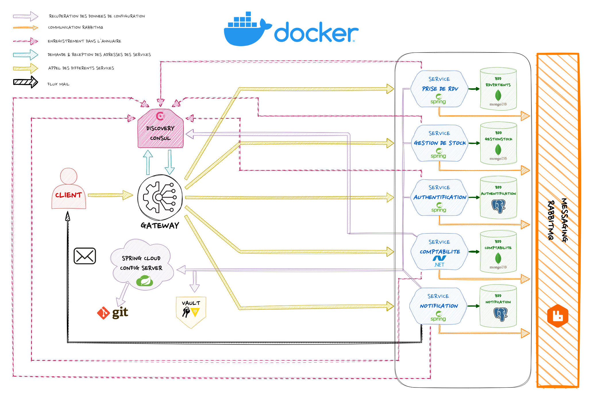

 $~~~$ $~~~$$~~~$
 
$~~~$$~~~$$~~~$$~~~$$~~~$

# Projet Hopital - Microservices
L'objectif du projet hopital était de développer une architecture de microservices pour une petite clinique afin d'améliorer la gestion des services de spécialistes médicaux et garantir une meilleure sécurité et évolutivité des données.

# Problématique
Une petite clinique offrant des services de spécialistes médicaux. Les patients peuvent prendre rendez-vous en ligne via notre plateforme Doctolib. Les médecins examinent les patients et fournissent tous les détails de la consultation, ainsi que les médicaments prescrits.

Le service de gestion des stocks gère les médicaments et passe des commandes auprès des fournisseurs. Le service de facturation génère des factures pour les fournisseurs et les clients. Nous avons également un système d'authentification pour les patients et le personnel, ainsi qu'un service de notification pour informer les patients par e-mail de leur rendez-vous et notifier le personnel de toute nouvelle affectation.

Nous sommes déterminés à fournir des soins de qualité à nos patients et à garantir la satisfaction de nos clients en fournissant des services de gestion de stock et de facturation efficaces et fiables.

------------------------------------------------------
# Acteurs
Voici les différents acteurs de l’application :
+ Personnel médical
+ Patients
+ Secrétaire
+ Comptable
+ Fournisseur
+ Administrateur

------------------------------------------------------

# Microservices
Il y a cinq microservices :

+ Microservice d'Authentification
+ Microservice de la gestion des stocks et des fournisseurs
+ Microservice de la gestion des rdv/patients et du personnel
+ Microservice de la creation des factures
+ Microservice des notifications

------------------------------------------------------

# Design Patterns utilisés

+ Service per team
+ Discovery Server (Consul server)
+ Database per Sevice
+ Load Balancing
+ Api Gateway (+Swagger)
+ Database per service (MongoDB, PostgreSQL...)
------------------------------------------------------

# Travail realisé

Notre équipe a travaillé sur le développement d'une architecture de micro services pour le projet-hopital. Nous avons commencé par mettre en place des services avec leurs bases de données dockerisées, en utilisant des modèles de conception tels que la façade et les contrôleurs pour garantir une bonne séparation des tâches.

Nous avons ensuite mis en place une passerelle (gateway) pour permettre l'accès aux microservices depuis l'extérieur de notre architecture. Pour gérer les services et leurs enregistrements dans l'annuaire, nous avons utilisé Consul, un outil open-source pour la gestion des services.
Nous avons également ajouté une couche d'authentification pour permettre aux utilisateurs d'accéder aux différents microservices en fonction de leurs rôles/permissions. Pour la communication interservices, nous avons utilisé Rabbit Mq, une solution de messagerie fiable et performante.
Nous avons mis en place une configuration centralisée à l'aide de Spring Cloud Config Server et Vault pour stocker les informations de configuration et les clés d'accès. Tout cela a été fait pour améliorer la gestion de la configuration et assurer une meilleure sécurité des données.

Enfin, nous avons mis en place des tests Karaté pour assurer une couverture complète de tests pour chaque service et pour les tests globaux. Grâce à ces efforts, notre architecture de micro services est devenu plus robuste, évolutive et facile à maintenir.

Veuillez trouver ci-joint un schéma d'architecture globale et un schéma qui précise les échanges RabbitMQ.

$~~~$

------------------------------------------------------
# Déploiement
+ Lancer le script **./run.sh** pour lancer tous l'environnement du projet. (Temps estimé: ~10min windows / ~7min linux)
------------------------------------------------------
# Technologies utilisées
+ Java 17
+ Spring Boot 3.0.4 ou 3.0.5
+ MongoDB latest
+ PostgreSQL latest
+ Docker
+ C# .NET 7

## Dépendances utilisées
+ Spring Cloud Config Server
+ Spring Cloud Consul
+ Spring Cloud Gateway
+ Spring boot Actuator
+ Auth2
+ OPEN API
+ Load Balancer
+ Karate
+ Vault
+ RabbitMQ
+ JUnit
------------------------------------------------------
# Equipe
+ Aaron BROSSEAU
+ Hind HACHEMI
+ Rachida EL OUARACHI 
+ Solomon LOURDESSAMY 
+ Aziz BEN JAZIA