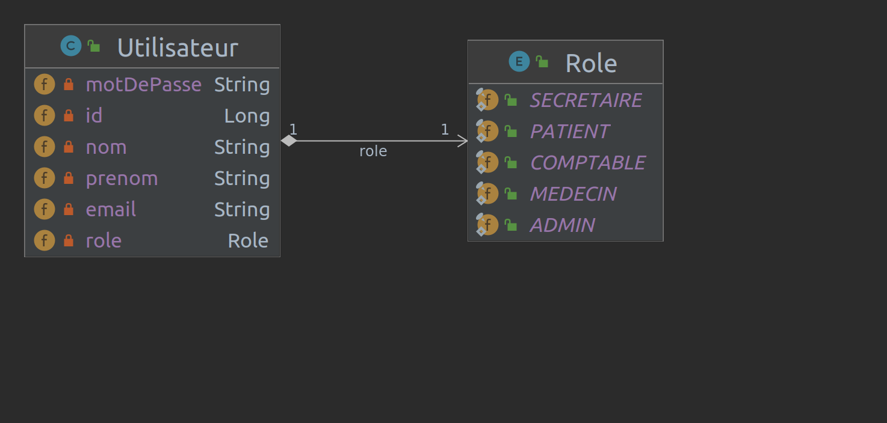

## Authentification

### Description

Le service d'authentification permet de gérer les utilisateurs et les rôles de l'application. Il permet de s'authentifier et de récupérer un token JWT.

### Technologies 

* Java 17
* Base de données PostgresSQL
* Spring Boot 3.0.4


### Security

* Spring Security
* Spring OAuth2
* Spring OpenID Connect ?

### Commande pour lancer consul

`docker run -d --name=dev-consul -p 8500:8500 -e CONSUL_BIND_INTERFACE=eth0 consul`

### Dépendances à ajouter dans le pom.xml de chaque service

**Consul**

    <dependency>
          <groupId>org.springframework.cloud</groupId>
          <artifactId>spring-cloud-starter-consul-discovery</artifactId>
    </dependency>

**Actuator**

    <dependency>
          <groupId>org.springframework.boot</groupId>
          <artifactId>spring-boot-starter-actuator</artifactId>
    </dependency>

### Commandes environnement de développement

**Serveur de base de données PostgresSQL**

```bash 
# Récupérer l'image docker de la base de données
docker pull postgres

# Lancer le serveur de base de données
docker run --name postgres -e POSTGRES_PASSWORD=postgres -d -p 5432:5432 postgres

# Vérifier que le serveur de base de données est bien lancé
docker ps

# Se connecter au serveur de base de données
docker exec -it postgres psql -U postgres

# Créer la base de données
CREATE DATABASE postgresbd;

# Créer un utilisateur
CREATE USER user WITH ENCRYPTED PASSWORD 'mdp';

# Donner les droits à l'utilisateur
GRANT ALL PRIVILEGES ON DATABASE postgresbd TO user;

# Quitter le serveur de base de données
\q

# debug docker socket
sudo systemctl restart docker.socket docker.service
docker rm -f <container id>
````

### Ordre de lancement

* Lancer le container docker de la BDD, s'assurer que la database est bien créée (voir commandes ci-dessus)

Lancer les services dans l'ordre suivant :
* consul
* gateway
* auth-service
* autres services
    
### Pour tester les services

Exectuer le fichier de test [requetes-auth.http](requetes-auth.http) à la racine du module service-authentification


### Backlog fonctionnel du service

    * [X] creer un compte
    * [X] se connecter
    * [X] se désinscrire
    * [X] modifier son mot de passe
    * [X] récupérer les infos de son propre compte
    * [X] récupérer la liste de tous les utilisateurs
    * [X] récupérer la liste des utilisateurs par rôle
**autres en réflexion selon l'utilité :** 

    * [ ] recuperer un token  
    * [ ] recuperer les infos de l'utilisateur par un
    * [ ] recuperer les roles de l'utilisateur

### Backlog technique du service
    
    * [x] configuration de la base de données POSTGRESQL et de l'ORM JPA
    * [x] configuration de spring security
    * [x] configuration de spring oauth2 resource server 
    * [ ] configuration de spring oauth2 authorization server
    * [x] gestion des accès aux ressources par rôles (scopes)
    * [x] securisation des endpoints avec spring security et spring oauth2 resource server par la génération d'un token JWT
    * [x] acces token 
    * [ ] refresh token recommandé pour les applications mobiles et openId connect
    * [x] scope
    * [ ] OpenAPI (swagger)
    * [ ] OpenAPI (springdoc)
    * [ ] OpenID Connect (OIDC)
    * [x] gestion des erreur et des exceptions [à peaufiner]
   

### API DESIGN (à compléter)

| colonne 1 | colonne 2 | colonne 3 |
|-----------|-----------|-----------|
|           |           |           |
|           |           |           |
|           |           |           |


### Diagramme de classe


    
### Autres schémas à venir